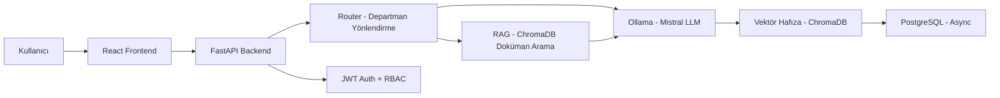

# 📘 Kurumsal AI Asistanı - Proje Referans Dokümanı

> **Proje Adı:** Kurumsal Yapay Zeka Asistanı – LOCAL & ÖĞRENEN  
> **Amaç:** Kurumsal kullanım için tasarlanmış, tamamen lokal çalışan ve öğrenen bir AI asistan sistemi.  
> **Son Güncelleme:** 10 Şubat 2026

---

## 📂 Proje Yapısı

```
CompanyAi/
├── app/                              # Ana uygulama modülleri
│   ├── __init__.py
│   ├── config.py                     # Pydantic settings (.env)
│   ├── main.py                       # FastAPI giriş noktası & lifespan
│   ├── api/
│   │   ├── __init__.py
│   │   └── routes/                   # REST API endpoint'leri
│   │       ├── admin.py              # Kullanıcı CRUD, dashboard stats
│   │       ├── ask.py                # AI soru-cevap (/api/ask)
│   │       ├── auth.py               # JWT auth (/api/auth)
│   │       ├── documents.py          # RAG doküman yönetimi (/api/rag)
│   │       ├── memory.py             # Hafıza API (/api/memory)
│   │       └── multimodal.py         # Dosya+resim destekli AI (/api/ask/multimodal)
│   ├── auth/                         # Kimlik & yetkilendirme
│   │   ├── jwt_handler.py            # JWT token + password hash (pbkdf2)
│   │   └── rbac.py                   # Rol tanımları + check_admin/check_admin_or_manager
│   ├── core/                         # Çekirdek işlem motoru
│   │   ├── audit.py                  # ✅ Denetim kaydı (AuditLog) yardımcısı
│   │   ├── constants.py              # Departman sabitleri (28 departman)
│   │   └── engine.py                 # Router → RAG → Memory → LLM pipeline
│   ├── db/                           # Veritabanı katmanı
│   │   ├── database.py               # Async SQLAlchemy engine & session
│   │   └── models.py                 # User, Query, AuditLog, SystemSettings
│   ├── llm/                          # Dil modeli entegrasyonu
│   │   ├── client.py                 # Ollama HTTP client (generate/stream/health/vision)
│   │   ├── local_llm.py              # ✅ OllamaClient wrapper (geriye uyumluluk)
│   │   └── prompts.py                # Departman/risk bazlı prompt şablonları
│   ├── memory/                       # Hafıza ve öğrenme sistemi
│   │   └── vector_memory.py          # ChromaDB + SentenceTransformers
│   ├── rag/                          # Retrieval Augmented Generation
│   │   └── vector_store.py           # Doküman chunk'lama & vektör arama (ChromaDB)
│   ├── router/                       # Akıllı yönlendirme
│   │   └── router.py                 # Keyword → departman/mod/risk yönlendirici
│   ├── voice/                        # Sesli asistan
│   │   └── field_assistant.py        # ✅ STT (Whisper) + TTS (pyttsx3/gTTS)
│   └── dashboard/                    # Yönetim paneli (eski yapı)
│       ├── backend/
│       └── frontend/
├── frontend/                         # React + TypeScript Dashboard
│   ├── src/
│   │   ├── App.tsx                   # React Router & Protected Routes
│   │   ├── main.tsx                  # Entry point
│   │   ├── constants.ts              # Frontend sabitleri
│   │   ├── contexts/
│   │   │   └── AuthContext.tsx        # JWT auth context
│   │   ├── services/
│   │   │   └── api.ts                # Axios API client
│   │   ├── pages/
│   │   │   ├── Ask.tsx               # AI soru-cevap (chat + multimodal)
│   │   │   ├── Dashboard.tsx         # Sistem istatistikleri
│   │   │   ├── Documents.tsx         # RAG doküman yönetimi
│   │   │   ├── Login.tsx             # Giriş sayfası
│   │   │   ├── Queries.tsx           # Sorgu geçmişi
│   │   │   ├── Settings.tsx          # Ayarlar
│   │   │   └── Users.tsx             # Kullanıcı yönetimi
│   │   └── components/
│   │       ├── FileUploadModal.tsx    # Dosya + kamera yükleme modal'ı
│   │       └── Layout.tsx            # Sidebar navigasyon
│   ├── package.json
│   ├── vite.config.ts
│   └── tailwind.config.js
├── docker/                           # Docker yapılandırması
│   ├── docker-compose.yml
│   ├── Dockerfile
│   └── nginx.conf
├── docs/                             # Dokümantasyon
│   ├── architecture/
│   └── deployment/
├── keys/                             # SSH anahtarları
├── backups/                          # Veritabanı yedekleri
├── memory-bank/                      # Copilot hafıza dosyaları
├── scripts/                          # Yardımcı scriptler
└── textile_knowledge_base/           # Tekstil bilgi tabanı
```

---

## 🏗️ Mimari Genel Bakış



### Veri Akışı
1. **Kullanıcı** → React frontend üzerinden soru gönderir (metin + dosya/resim)
2. **FastAPI (`main.py`)** → JWT ile kimlik doğrular, isteği Engine'e yönlendirir
3. **Router (`router.py`)** → Keyword tabanlı departman, mod ve risk seviyesi belirler
4. **RAG (`vector_store.py`)** → ChromaDB'den ilgili dokümanları arar
5. **LLM Client (`client.py`)** → Ollama/Mistral'e prompt gönderir, yanıt alır
6. **Vector Memory (`vector_memory.py`)** → Soru/cevap çiftini ChromaDB hafızasına kaydeder
7. **PostgreSQL** → Sorgu ve kullanıcı kayıtlarını saklar

---

## 📦 Modül Detayları

### 1. FastAPI Uygulaması (`app/main.py`)

**Teknoloji:** FastAPI + Async Lifespan  
**Durum:** ✅ Tamamlandı

**Özellikler:**
- Async lifespan ile DB init ve admin kullanıcı oluşturma
- CORS middleware (konfigüre edilebilir origins)
- Structured logging (structlog)

**Endpoint Router'lar:**
| Prefix | Router | Açıklama |
|--------|--------|----------|
| `/api/auth` | auth | JWT kimlik doğrulama |
| `/api` | ask | AI soru-cevap + SSE streaming |
| `/api/memory` | memory | Hafıza yönetimi |
| `/api/admin` | admin | Kullanıcı CRUD, dashboard, settings, audit |
| `/api/rag` | documents | RAG doküman yönetimi |
| `/api` | multimodal | Dosya + resim destekli AI (vision LLM) |

---

### 2. Çekirdek Motor (`app/core/engine.py`)

**Durum:** ✅ Tamamlandı

**Fonksiyon:** `process_question(question, user, department, ...)`

**İşleyiş:**
1. Router'dan departman/mod/risk konteksti alır (`decide`)
2. RAG'den ilgili dokümanları arar (`vector_store.search_documents`)
3. Hafızadan geçmiş sorguları çeker (`vector_memory.search`)
4. **Prompt oluşturur (`build_prompt` / `build_rag_prompt` / `build_analysis_prompt`)**
5. Ollama LLM'e gönderir (`ollama_client.generate`)
6. Cevabı hafızaya kaydeder (`vector_memory.remember`)
7. Sorguyu PostgreSQL'e loglar

**Bağımlılıklar:**
- `router.router.decide`
- `llm.client.OllamaClient`
- `llm.prompts.build_prompt` / `build_rag_prompt` / `build_analysis_prompt`
- `memory.vector_memory` (remember, search)
- `rag.vector_store` (search_documents)

---

### 3. Ollama LLM Client (`app/llm/client.py`)

**Durum:** ✅ Tamamlandı

**Sınıf:** `OllamaClient`

| Metod | Açıklama |
|-------|----------|
| `generate(prompt, system, model, images)` | Non-streaming yanıt (vision desteği dahil) |
| `stream(prompt, system)` | Streaming yanıt (AsyncGenerator) — `/api/ask/stream` SSE |
| `is_available()` | Health check (structlog ile loglanmış) |
| `get_models()` | Model listeleme |

**Entegrasyon:** Ollama REST API (`http://127.0.0.1:11434`)  
**Vision Model:** LLaVA (`self.vision_model`) — görüntü içeren istek geldiğinde otomatik aktifleşir.

---

### 4. Prompt Şablonları (`app/llm/prompts.py`)

**Durum:** ✅ Tamamlandı

| Fonksiyon | Açıklama |
|-----------|----------|
| `build_prompt(question, context)` | Temel system+user prompt |
| `build_rag_prompt(question, docs, context)` | RAG doküman bağlamlı prompt |
| `build_analysis_prompt(question, history)` | Geçmiş sorgulu analiz prompt'u |

> ✅ `build_analysis_prompt()` artık `engine.py`'de geçmiş (history) verisi olduğunda otomatik kullanılıyor.

---

### 5. Akıllı Router (`app/router/router.py`)

**Durum:** ✅ Tamamlandı

**Fonksiyon:** `decide(question: str) → dict`

**Yönlendirme Kuralları:**
| Anahtar Kelimeler | Departman | Mod | Risk |
|-------------------|-----------|-----|------|
| "fire", "üretim" | Üretim | Analiz | Orta |
| "nakit", "kâr" | Finans | Yönetim | Orta |
| Diğer | Yönetim | Analiz | Düşük |

**Çıktı:** `{"dept": "Üretim", "mode": "Analiz", "risk": "Orta"}`

> 💡 Keyword tabanlı basit matcher — ileride NLP/ML sınıflandırıcıya yükseltilebilir.

---

### 6. Vektör Hafıza (`app/memory/vector_memory.py`)

**Durum:** ✅ Tamamlandı  
**Teknoloji:** ChromaDB + SentenceTransformers (`all-MiniLM-L6-v2`)

| Fonksiyon | Açıklama |
|-----------|----------|
| `remember(q, a, meta)` | Soru/cevap çiftini ChromaDB'ye kaydet |
| `recall(limit)` | Son kayıtları getir |
| `search(query, n)` | Vektör benzerlik araması |
| `clear()` | Hafızayı temizle |
| `get_stats()` | İstatistikler (toplam kayıt, ChromaDB durumu) |

**Veri Yolu:** `/opt/companyai/data/chromadb`

---

### 7. RAG Vektör Deposu (`app/rag/vector_store.py`)

**Durum:** ✅ Tamamlandı  
**Teknoloji:** ChromaDB + SentenceTransformers

| Fonksiyon | Açıklama |
|-----------|----------|
| `add_document(text, metadata)` | Dokümanı chunk'la ve ChromaDB'ye ekle |
| `search_documents(query, n)` | Vektör benzerlik araması |
| `list_documents()` | Tüm dokümanları listele |
| `delete_document(id)` | Doküman sil |
| `clear_all_documents()` | Tüm dokümanları temizle |

**Desteklenen Formatlar:** 65+ format (v2)
- **Metin:** .txt, .md, .csv, .json, .xml, .html, .htm, .rtf, .rst, .tex, .ini, .cfg, .env, .toml, .properties
- **Office:** .pdf, .docx, .doc, .xlsx, .xls, .pptx, .ppt, .odt, .ods, .odp, .epub
- **Kod:** .py, .js, .ts, .jsx, .tsx, .java, .cs, .cpp, .c, .h, .hpp, .sql, .yaml, .yml, .go, .rb, .php, .swift, .kt, .scala, .rs, .r, .sh, .bat, .ps1, .dockerfile, .vue, .svelte, .graphql, .gql, .proto
- **E-posta:** .eml, .msg
- **Görüntü (OCR):** .png, .jpg, .jpeg, .gif, .bmp, .tiff, .tif, .webp
- **Log:** .log

**Öğrenme Kaynakları:**
| Kaynak | Endpoint | Açıklama |
|--------|----------|----------|
| Dosya Yükleme | `POST /rag/documents/upload` | Tekli dosya (65+ format) |
| Çoklu Dosya | `POST /rag/documents/upload-multiple` | Klasör yükleme |
| Metin Girişi | `POST /rag/teach` | Elle/sesle metin girişi |
| URL/Web Sayfası | `POST /rag/learn-url` | Web scraping (httpx + BeautifulSoup) |
| YouTube Video | `POST /rag/learn-video` | Altyazı çekme (youtube-transcript-api) |

**Ek Bağımlılıklar (URL/Video):** beautifulsoup4, lxml, youtube-transcript-api, striprtf

---

### 8. Kimlik & Yetkilendirme

#### JWT Handler (`app/auth/jwt_handler.py`) — ✅ Tamamlandı
- `create_access_token()` — JWT oluşturma
- `verify_token()` — JWT doğrulama
- `hash_password()` / `verify_password()` — pbkdf2_sha256

#### RBAC (`app/auth/rbac.py`) — ✅ Tamamlandı
- `Role` enum: ADMIN, MANAGER, USER
- `get_permissions()` / `has_permission()`
- `check_admin(user)` / `check_admin_or_manager(user)` / `check_any_authenticated(user)` — FastAPI Depends() uyumlu RBAC checker fonksiyonları

> ✅ Tüm admin endpoint'lerinde `check_admin()` ve `check_admin_or_manager()` aktif olarak kullanılıyor.

---

### 9. Veritabanı (`app/db/`)

#### database.py — ✅ Tamamlandı
- Async SQLAlchemy engine + session factory
- `get_db()` FastAPI dependency
- `init_db()` — tablo oluşturma

#### models.py — ✅ Tamamlandı
| Model | Durum | Açıklama |
|-------|-------|----------|
| `User` | ✅ Aktif | email, role, department, is_active |
| `Query` | ✅ Aktif | AI sorgu kaydı |
| `AuditLog` | ✅ Aktif | Denetim kaydı — login, query, admin işlemlerinde kullanılıyor |
| `SystemSettings` | ✅ Aktif | Key-value ayarları — admin settings CRUD endpoint'leri mevcut |

---

### 10. Multimodal AI (`app/api/routes/multimodal.py`)

**Durum:** ✅ Tamamlandı

| Endpoint | Method | Açıklama |
|----------|--------|----------|
| `/api/ask/multimodal` | POST | Dosya + resim destekli soru-cevap (vision LLM) |
| `/api/upload/image` | POST | Tek resim yükleme |
| `/api/upload/document` | POST | Tek doküman yükleme |

**Kısıtlamalar:** Max 50MB dosya boyutu, max 10 dosya  
> ✅ Resimler base64'e çevrilip `ollama_client.generate(images=...)` ile LLaVA vision modeline gönderiliyor.

---

### 11. Sesli Saha Asistanı (`app/voice/field_assistant.py`)

**Durum:** ✅ Tamamlandı

| Özellik | Teknoloji | Açıklama |
|---------|-----------|----------|
| STT | OpenAI Whisper (lokal) | `speech_to_text(audio_bytes, language)` |
| TTS | pyttsx3 (çevrimdışı) / gTTS (fallback) | `text_to_speech(text, language, engine)` |
| Durum | `get_voice_status()` | Whisper/pyttsx3/gTTS kullanılabilirlik kontrolü |

---

### 12. Frontend (`frontend/src/`)

**Teknoloji:** React + TypeScript + Vite + Tailwind CSS

| Sayfa | Durum | Açıklama |
|-------|-------|----------|
| `Login.tsx` | ✅ | JWT giriş |
| `Ask.tsx` | ✅ | Chat + multimodal soru-cevap |
| `Documents.tsx` | ✅ | RAG doküman yönetimi — 4 sekmeli (Dosya/Bilgi/URL/Video), klasör ağacı, doküman tablosu |
| `Dashboard.tsx` | ✅ | Grafik + CPU/Memory gerçek API'den (çekilmiş) |
| `Queries.tsx` | ✅ | Sorgu geçmişi (departman filtreli) |
| `Users.tsx` | ✅ | Kullanıcı CRUD (admin only) |
| `Settings.tsx` | ✅ | Ayarlar |

**Bileşenler:**
- `Layout.tsx` — Sidebar navigasyon (rol bazlı menü filtreleme)
- `FileUploadModal.tsx` — Drag&drop + kamera dosya yükleme
- `AuthContext.tsx` — JWT token yönetimi

---

## 🚀 Kurulum ve Çalıştırma

### Gereksinimler
- Python 3.10+
- FastAPI + Uvicorn
- PostgreSQL (asyncpg)
- Ollama + Mistral modeli
- ChromaDB + SentenceTransformers
- Node.js 18+ (frontend)

### Lokal Kurulum (Development)
```bash
# Backend bağımlılıkları
pip install -r requirements.txt

# API'yi başlat
uvicorn app.main:app --reload --loop asyncio

# Frontend
cd frontend && npm install && npm run dev
```

### Sunucu Kurulumu (Production)
```bash
# Backend — systemd servisi
sudo systemctl start companyai-backend

# Komut:
/usr/local/bin/uvicorn app.main:app --host 0.0.0.0 --port 8000 --loop asyncio
```

---

## 🔧 Teknoloji Stack'i

| Katman | Teknoloji | Durum |
|--------|-----------|-------|
| API Framework | FastAPI + Uvicorn | ✅ Aktif |
| LLM | Ollama + Mistral | ✅ Aktif |
| Vector DB | ChromaDB + SentenceTransformers | ✅ Aktif |
| Database | PostgreSQL + AsyncPG | ✅ Aktif |
| Auth | JWT + pbkdf2_sha256 + RBAC | ✅ Aktif |
| Cache | Redis | ⚠️ Konfigüre ama kullanılmıyor |
| Frontend | React + TypeScript + Vite + Tailwind | ✅ Aktif |
| Reverse Proxy | Nginx (SSL) | ✅ Aktif |
| STT | OpenAI Whisper (lokal) | ✅ Aktif |
| TTS | pyttsx3 / gTTS | ✅ Aktif |

---

## 📋 Geliştirme Yol Haritası

### ✅ Tamamlanan
- [x] FastAPI backend + async PostgreSQL entegrasyonu
- [x] JWT authentication + pbkdf2_sha256 hashing
- [x] RBAC rol tanımları (Admin/Manager/User)
- [x] Ollama/Mistral LLM entegrasyonu (client.py)
- [x] ChromaDB vektör hafıza + SentenceTransformers
- [x] RAG doküman yönetimi (65+ format desteği, URL/video öğrenme)
- [x] Multimodal API (dosya + resim)
- [x] React frontend (Login, Ask, Documents, Dashboard, Users, Queries, Settings)
- [x] Nginx reverse proxy + SSL (self-signed)
- [x] Systemd servisi olarak deployment
- [x] Otomatik yedekleme (cronjob)
- [x] Departman bazlı yetkilendirme

### 🔴 Yarım Kalan / Bekleyen
- [x] `local_llm.py` dosyası ölü kod — ✅ `OllamaClient` wrapper'a dönüştürüldü
- [x] `field_assistant.py` sesli asistan — ✅ Whisper STT + pyttsx3/gTTS TTS implemente edildi
- [x] `AuditLog` modeli — ✅ `app/core/audit.py` ile login, query, admin işlemlerine entegre edildi
- [x] `SystemSettings` modeli — ✅ Admin settings CRUD endpoint'leri (GET/PUT/DELETE) eklendi
- [x] Dashboard grafik verileri — ✅ Gerçek API'den çekiliyor (query-traffic, system-resources)
- [x] `memory/stats` endpoint'inde auth kontrolü — ✅ Tekrar aktifleştirildi
- [x] RBAC kontrolleri — ✅ `check_admin()` / `check_admin_or_manager()` tüm admin endpoint'lerine uygulandı
- [x] Multimodal vision LLM — ✅ LLaVA entegrasyonu tamamlandı (base64 image → ollama generate)
- [x] Streaming yanıt — ✅ `/api/ask/stream` SSE endpoint'i eklendi (StreamingResponse)
- [x] `build_analysis_prompt()` — ✅ `engine.py`'de geçmiş (history) verisi olduğunda otomatik kullanılıyor
- [x] LLM client DEBUG print ifadeleri — ✅ structlog'a dönüştürüldü
- [ ] Redis konfigüre edilmiş ama aktif olarak kullanılmıyor

### ✅ Doküman Yönetimi v2 (Phase 5 - 10 Şubat 2026)
- [x] Departman bazlı doküman kütüphanesi (tablo görünümü: kaynak, tür, departman, ekleyen, tarih, parça sayısı)
- [x] Genişletilmiş format desteği (27 → 65+ format: RTF, ODT, EPUB, e-posta, görüntü OCR, 20+ programlama dili)
- [x] Klasör seçme ve alt klasör ağacı (webkitdirectory + FolderTreeView bileşeni)
- [x] URL/Web sayfası öğrenme (`POST /rag/learn-url` — httpx + BeautifulSoup ile scraping)
- [x] YouTube video öğrenme (`POST /rag/learn-video` — youtube-transcript-api ile altyazı çekme, 9 dil)
- [x] 4 sekmeli öğrenme arayüzü (Dosya Yükle / Bilgi Gir / URL Öğren / Video Öğren)
- [x] Sistem yetenek durumu endpoint'i (`GET /rag/capabilities`)
- [x] Tür/departman filtreli doküman listesi + yenileme butonu

---

## 📝 Önemli Notlar

1. **Offline Çalışma:** Sistem tamamen lokal çalışacak şekilde tasarlanmıştır
2. **Öğrenme:** Her soru/cevap çifti ChromaDB hafızasına kaydedilerek sistem öğrenir
3. **Kurumsal Odak:** Departman bazlı yönlendirme, risk analizi ve RBAC içerir
4. **Modüler Yapı:** Her bileşen bağımsız olarak geliştirilebilir
5. **Docker → Native Geçiş:** Backend ve frontend Docker'dan çıkarıldı; backend systemd, frontend Nginx üzerinden çalışıyor. Yalnızca PostgreSQL hâlâ Docker container'da olabilir.
6. **Hashing:** `bcrypt` → `pbkdf2_sha256` geçişi tamamlandı
7. **Async:** Tüm DB operasyonları `asyncpg` + `SQLAlchemy async` ile yapılıyor
8. **ChromaDB Yolu:** Hem memory hem RAG için `/opt/companyai/data/chromadb` — Windows'ta çalışmaz, lokal dev için yapılandırılabilir olmalı

---


---

## 🌍 Canlı Sunucu Bilgileri (Deployment)

**Sunucu IP:** `192.168.0.12`  
**URL:** `https://192.168.0.12` (HTTPS Aktif — Self-Signed Sertifika)  
**Kullanıcı:** `root`  
**Şifre:** `435102`  
**SSH Key:** `keys/companyai_key` (Ed25519, comment: `companyai-deploy`)  
**SSH Key Public:** `keys/companyai_key.pub`  
**Key Fingerprint:** `SHA256:avkGBtNyqcbRQxfMZR+0IpS0W3Eb6gMgcbmVc9E9kD0`

### SSH Bağlantısı
```bash
# Key ile bağlan (önerilen)
ssh -i keys/companyai_key root@192.168.0.12

# Şifre ile bağlan
ssh root@192.168.0.12
# Şifre: 435102
```

### Deploy Komutu
```bash
# Otomatik deploy (backend + bağımlılık + servis restart)
python deploy_now.py

# Frontend deploy (build + nginx)
cd frontend && npm run build && cd .. && python deploy_frontend.py
```

---

## 🛠️ Deployment Geçmişi ve Durum Notları (6 Şubat 2026)

### Yapılan Kritik Düzeltmeler ve Mimari Değişiklikler:
1.  **Docker'dan Native Geçiş:** Performans ve Ollama erişim kolaylığı için Docker container yapısı (Backend/Frontend için) iptal edildi. Backend artık `systemd` servisi olarak, Frontend ise doğrudan `Nginx` üzerinden çalışıyor.
2.  **Hashing Algoritması:** `bcrypt` yerine `pbkdf2_sha256` geçişi tamamlandı.
3.  **Ollama Entegrasyonu:** `OLLAMA_BASE_URL` üzerinden `127.0.0.1:11434` bağlantısı sağlandı. Bağlantı hatalarını debug etmek için `client.py` logları geliştirildi.
4.  **Nginx Yapılandırması:** Port 80 çakışmaları (Docker proxy) giderildi. `/api` ve `/docs` yönlendirmeleri `127.0.0.1:8000`'e çekildi.
5.  **Ortam Değişkenleri:** `.env` dosyası Pydantic validasyon hataları nedeniyle temizlendi, kritik ayarlar doğrudan `systemd` servis dosyasına (`companyai-backend.service`) taşındı.

### Mevcut Durum:
-   **Frontend:** Aktif (Nginx /var/www/html).
-   **Backend:** Aktif (Systemd, Port 8000).
-   **LLM (Ollama):** Mistral aktif, backend erişimi doğrulandı.
-   **Veritabanı:** PostgreSQL hala Docker container (`companyai-db`) içinde çalışıyor.

### Yarım Kalan / Bekleyen İşler (6 Şubat):
-   [x] **DB Entegrasyonu:** ✅ 8 Şubat'ta `asyncpg` ile çözüldü.
-   [ ] **AI Cevap Kalitesi:** Mistral modelinin kurumsal verilerle test edilmesi.
-   [x] **Vektör Veritabanı:** ✅ 8 Şubat'ta ChromaDB + SentenceTransformers ile tamamlandı.
-   [x] **SSL Kurulumu:** ✅ 8 Şubat'ta self-signed sertifika ile tamamlandı.
-   [x] **Otomatik Yedekleme:** ✅ 8 Şubat'ta cronjob ile tamamlandı.

---

## 🛠️ Deployment Geçmişi ve Durum Notları (07 Şubat 2026)

### ✅ Tamamlanan Deployment (Native Ubuntu)
Proje Docker bağımlılığından tamamen kurtarılarak Ubuntu sunucusu üzerinde native olarak çalışır hale getirilmiştir.

### 🔑 Kritik Yapılandırmalar ve Çözümler

#### 1. Veritabanı (PostgreSQL)
- **Sorun:** Varsayılan 5432 portunda çakışma yaşandı veya önceki kurulumlardan dolayı kilitliydi.
- **Çözüm:** PostgreSQL portu **5433** olarak değiştirildi.
- **Erişim:**
  - Port: 5433
  - Kullanıcı: `companyai`
  - Veritabanı: `companyai`
- **Komut:** `psql -p 5433 -U companyai -d companyai`

#### 2. Backend Servisi (Systemd)
- **Servis Dosyası:** `/etc/systemd/system/companyai-backend.service`
- **Loop Fix:** `asyncpg` ve `uvloop` uyumsuzluğu nedeniyle `uvicorn` başlatma komutuna `--loop asyncio` parametresi eklendi.
- **Çalıştırma Komutu:**
  ```bash
  /usr/local/bin/uvicorn app.main:app --host 0.0.0.0 --port 8000 --loop asyncio
  ```

#### 3. Nginx Proxy
- **Config:** `/etc/nginx/sites-available/default`
- **Yönlendirme:**
  - Frontend (`/`) -> `/var/www/html`
  - API (`/api`) -> `http://127.0.0.1:8000`

#### 4. Multimodal Özellikler
- **Destek:** Resim, PDF, DOCX, XLXS yükleme, Kamera ile fotoğraf çekme.
- **Kısıtlamalar:** Max 50MB dosya boyutu, max 10 dosya.
- **Endpoint:** `/api/ask/multimodal`

### 📂 Önemli Dosya Yolları (Sunucu)
- **Proje:** `/opt/companyai`
- **Environment:** `/opt/companyai/.env`
- **Loglar:** `journalctl -u companyai-backend`

### 🚑 Acil Durum Müdahalesi
Servis yanıt vermezse:
```bash
sudo systemctl restart companyai-backend
sudo systemctl restart nginx
```

---

## 🛠️ Deployment Geçmişi ve Durum Notları (8 Şubat 2026)

### ✅ Tamamlanan Kritik İyileştirmeler

#### 1. Veritabanı (PostgreSQL + AsyncPG)
- **Sorun:** SQLAlchmey async engine, standart `postgresql://` URL'i ile çalışmıyordu.
- **Çözüm:** `.env` dosyasında `DATABASE_URL=postgresql+asyncpg://...` formatına geçildi.
- **Sonuç:** Backend servisi veritabanına başarıyla bağlandı ve sağlıklı çalışıyor.

#### 2. Vektör Hafıza (ChromaDB)
- **Teknoloji:** ChromaDB + SentenceTransformers (`all-MiniLM-L6-v2`).
- **Özellikler:** 
  - `vector_memory.py` güncellendi.
  - Yeni API endpointleri eklendi:
    - `GET /api/memory/stats`: Hafıza durumu.
    - `GET /api/memory/search`: Semantik arama.
    - `DELETE /api/memory/clear`: Hafızayı sıfırlama.
- **Veri Yolu:** `/opt/companyai/data/chromadb`

#### 3. SSL Güvenliği (HTTPS)
- **Yapılandırma:** Nginx, Self-Signed sertifika ile 443 portunu dinliyor.
- **Yönlendirme:** Tüm HTTP (80) istekleri otomatik olarak HTTPS (443)'e yönlendiriliyor.
- **Sertifika Yolu:** `/etc/nginx/ssl/companyai.crt`

#### 4. Otomatik Yedekleme
- **Script:** `/usr/local/bin/companyai-backup.sh`
- **Zamanlama:** Her gece 03:00 (Cronjob).
- **Konum:** `/opt/companyai/backups/` (Son 7 günlük yedek saklanır).


---

## 📅 Günlük Notlar: 09 Şubat 2026

### 🔄 Yedekleme Kaydı
- **Saat:** 08:39 (Yerel), 05:05 (Sunucu)
- **Dosya:** `backup_20260209_050530.sql.gz`
- **Konum (Local):** `Desktop/Python/CompanyAi/backups/backup_latest.sql.gz`
- **Konum (Sunucu):** `/opt/companyai/backups/`
- **Durum:** Manuel yedekleme başarıyla tamamlandı ve locale indirildi.

### ✅ Tamamlanan İşler (9 Şubat Özet)
1. **Veritabanı Bağlantısı:** `asyncpg` entegrasyonu ile düzeltildi.
2. **Vektör Hafıza:** ChromaDB kuruldu ve API'ye bağlandı (`/api/memory`).
3. **Güvenlik (SSL):** Sunucuda HTTPS aktif edildi. Self-signed sertifika kullanılıyor.
4. **Otomatik Yedek:** Her gece 03:00'te çalışan script kuruldu.
5. **Rol Bazlı Erişim Kontrolü (RBAC):**
    - Navigasyon menüsü rollere göre dinamik olarak filtreleniyor.
    - Sorgu geçmişi ve doküman listesi departman bazlı yetkilendirildi.
6. **Gelişmiş Doküman Yönetimi & Yetki:**
    - 20'den fazla dosya formatı desteği eklendi.
    - Çoklu dosya ve klasör yükleme entegre edildi.
    - `/auth/me` endpoint'ine `department` alanı eklendi.
    - Departman bazlı doküman erişim kontrolü sağlandı.

### 📝 Sonraki Adımlar
- [ ] AI modelinin (Mistral) yanıt kalitesini test et
- [x] Dashboard grafik verilerini gerçek API'den çek (mock data kaldır)
- [x] `local_llm.py` ölü kodunu temizle
- [x] `field_assistant.py` sesli asistanı implemente et
- [x] `AuditLog` ve `SystemSettings` modellerini aktif kullan
- [x] Memory stats endpoint'inde auth'u geri aç
- [x] Multimodal resim analizi için vision LLM entegrasyonu
- [ ] Redis cache entegrasyonunu aktifleştir
- [ ] Voice API endpoint'lerini oluştur (STT/TTS HTTP API)
- [ ] Unit test suite'i oluştur
