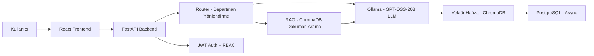

# 📘 Kurumsal AI Asistanı - Proje Referans Dokümanı

> **Proje Adı:** Kurumsal Yapay Zeka Asistanı – LOCAL & ÖĞRENEN  
> **Amaç:** Kurumsal kullanım için tasarlanmış, tamamen lokal çalışan ve öğrenen bir AI asistan sistemi.  
> **Son Güncelleme:** 11 Şubat 2026 (v2.9.0 — Backup & Restore + Sesli Asistan)

---

## 📂 Proje Yapısı

```
CompanyAi/
├── app/                              # Ana uygulama modülleri
│   ├── __init__.py
│   ├── config.py                     # Pydantic settings (.env)
│   ├── main.py                       # FastAPI giriş noktası & lifespan
│   ├── api/
│   │   ├── __init__.py
│   │   └── routes/                   # REST API endpoint'leri
│   │       ├── admin.py              # Kullanıcı CRUD, dashboard stats
│   │       ├── ask.py                # AI soru-cevap (/api/ask)
│   │       ├── auth.py               # JWT auth (/api/auth)
│   │       ├── documents.py          # RAG doküman yönetimi (/api/rag)
│   │       ├── export.py             # Export API (/api/export) — Excel/PDF/PPTX/Word/CSV
│   │       ├── memory.py             # Hafıza API (/api/memory)
│   │       └── multimodal.py         # Dosya+resim destekli AI (/api/ask/multimodal)
│   ├── auth/                         # Kimlik & yetkilendirme
│   │   ├── jwt_handler.py            # JWT token (access+refresh) + password hash (pbkdf2)
│   │   └── rbac.py                   # Rol tanımları + check_admin/check_admin_or_manager
│   ├── core/                         # Çekirdek işlem motoru
│   │   ├── audit.py                  # Denetim kaydı (AuditLog) yardımcısı
│   │   ├── constants.py              # Departman sabitleri (28 departman)
│   │   ├── engine.py                 # Router → RAG → Memory → Web → Export → LLM pipeline
│   │   └── export_service.py         # Excel/PDF/PPTX/Word/CSV üretici
│   ├── db/                           # Veritabanı katmanı
│   │   ├── database.py               # Async SQLAlchemy engine & session
│   │   └── models.py                 # User, Query, AuditLog, SystemSettings
│   ├── llm/                          # Dil modeli entegrasyonu
│   │   ├── client.py                 # Ollama HTTP client (connection pooling + generate/stream/health/vision)
│   │   ├── local_llm.py              # OllamaClient wrapper (geriye uyumluluk)
│   │   ├── prompts.py                # Departman/risk bazlı prompt şablonları + injection koruması
│   │   └── web_search.py             # SerpAPI + Google Images + DuckDuckGo fallback
│   ├── memory/                       # Hafıza ve öğrenme sistemi
│   │   ├── persistent_memory.py      # PostgreSQL sohbet geçmişi + session yönetimi
│   │   └── vector_memory.py          # ChromaDB + SentenceTransformers
│   ├── rag/                          # Retrieval Augmented Generation
│   │   └── vector_store.py           # Doküman chunk'lama & vektör arama (ChromaDB)
│   ├── router/                       # Akıllı yönlendirme
│   │   └── router.py                 # Keyword → departman/mod/risk yönlendirici
│   └── voice/                        # Sesli asistan
│       └── field_assistant.py        # STT (Whisper) + TTS (pyttsx3/gTTS)
├── frontend/                         # React + TypeScript Dashboard
│   ├── capacitor.config.ts           # ★ Capacitor mobil ayarları (sunucu URL, splash, statusbar)
│   ├── package.json                  # npm bağımlılıkları + mobile scriptler
│   ├── vite.config.ts                # Vite dev server + proxy
│   ├── tailwind.config.js
│   ├── public/
│   │   └── error.html                # ★ Mobil — sunucu bağlantı hatası sayfası
│   ├── src/
│   │   ├── App.tsx                   # React Router & Protected Routes
│   │   ├── main.tsx                  # Entry point
│   │   ├── constants.ts              # Frontend sabitleri + APP_VERSION
│   │   ├── contexts/
│   │   │   └── AuthContext.tsx        # JWT auth context
│   │   ├── services/
│   │   │   └── api.ts                # Axios API client
│   │   ├── pages/
│   │   │   ├── Ask.tsx               # AI soru-cevap (chat + multimodal)
│   │   │   ├── Dashboard.tsx         # Sistem istatistikleri
│   │   │   ├── Documents.tsx         # RAG doküman yönetimi
│   │   │   ├── Login.tsx             # Giriş sayfası
│   │   │   ├── Queries.tsx           # Sorgu geçmişi
│   │   │   ├── Settings.tsx          # Ayarlar
│   │   │   └── Users.tsx             # Kullanıcı yönetimi
│   │   └── components/
│   │       ├── DesktopBanner.tsx      # Desktop app indirme banner'ı
│   │       ├── ExportCard.tsx         # Export indirme kartı
│   │       ├── FileUploadModal.tsx    # Dosya + kamera yükleme modal'ı
│   │       ├── Layout.tsx            # Sidebar navigasyon
│   │       ├── QuickExportButtons.tsx # Her mesajdan export butonları
│   │       └── WeatherCard.tsx        # Hava durumu kartı
│   │   │   ├── AndroidManifest.xml   # HTTP izni + networkSecurityConfig
│   │   │   └── res/
│   ├── app.py                        # pywebview native pencere (cross-platform)
│   ├── build.bat                     # Windows build scripti
├── keys/                             # SSH anahtarları
├── backups/                          # Veritabanı yedekleri

> ★ Phase 21'de eklenen / güncellenen dosyalar
## 🏗️ Mimari Genel Bakış



### Veri Akışı
1. **Kullanıcı** → React frontend üzerinden soru gönderir (metin + dosya/resim)
2. **FastAPI (`main.py`)** → JWT ile kimlik doğrular, isteği Engine'e yönlendirir
3. **Router (`router.py`)** → Keyword tabanlı departman, mod ve risk seviyesi belirler
4. **RAG (`vector_store.py`)** → ChromaDB'den ilgili dokümanları arar
5. **LLM Client (`client.py`)** → Ollama/Mistral'e prompt gönderir, yanıt alır
6. **Vector Memory (`vector_memory.py`)** → Soru/cevap çiftini ChromaDB hafızasına kaydeder
7. **PostgreSQL** → Sorgu ve kullanıcı kayıtlarını saklar

---

## 📦 Modül Detayları

### 1. FastAPI Uygulaması (`app/main.py`)

**Teknoloji:** FastAPI + Async Lifespan  
**Durum:** ✅ Tamamlandı

**Özellikler:**
- Async lifespan ile DB init ve admin kullanıcı oluşturma
- CORS middleware (konfigüre edilebilir origins)
- Structured logging (structlog)

**Endpoint Router'lar:**
| Prefix | Router | Açıklama |
|--------|--------|----------|
| `/api/auth` | auth | JWT kimlik doğrulama |
| `/api` | ask | AI soru-cevap + SSE streaming |
| `/api/memory` | memory | Hafıza yönetimi + oturum (session) API |
| `/api/admin` | admin | Kullanıcı CRUD, dashboard, settings, audit |
| `/api/rag` | documents | RAG doküman yönetimi |
| `/api` | multimodal | Dosya + resim destekli AI (vision LLM) |
| `/api/backup` | backup | ★ Yedekleme & geri yükleme (PG + ChromaDB) |

---

### 2. Çekirdek Motor (`app/core/engine.py`)

**Durum:** ✅ Tamamlandı

**Fonksiyon:** `process_question(question, user, department, ...)`

**İşleyiş:**
1. Router'dan departman/mod/risk konteksti alır (`decide`)
2. RAG'den ilgili dokümanları arar (`vector_store.search_documents`)
3. Hafızadan geçmiş sorguları çeker (`vector_memory.search`)
4. **Prompt oluşturur (`build_prompt` / `build_rag_prompt` / `build_analysis_prompt`)**
5. Ollama LLM'e gönderir (`ollama_client.generate`)
6. Cevabı hafızaya kaydeder (`vector_memory.remember`)
7. Sorguyu PostgreSQL'e loglar

**Bağımlılıklar:**
- `router.router.decide`
- `llm.client.OllamaClient`
- `llm.prompts.build_prompt` / `build_rag_prompt` / `build_analysis_prompt`
- `memory.vector_memory` (remember, search)
- `rag.vector_store` (search_documents)

---

### 3. Ollama LLM Client (`app/llm/client.py`)

**Durum:** ✅ Tamamlandı

**Sınıf:** `OllamaClient`

| Metod | Açıklama |
|-------|----------|
| `generate(prompt, system, model, images)` | Non-streaming yanıt (vision desteği dahil) |
| `stream(prompt, system)` | Streaming yanıt (AsyncGenerator) — `/api/ask/stream` SSE |
| `is_available()` | Health check (structlog ile loglanmış) |
| `get_models()` | Model listeleme |

**Entegrasyon:** Ollama REST API (`http://127.0.0.1:11434`)  
**Vision Model:** LLaVA (`self.vision_model`) — görüntü içeren istek geldiğinde otomatik aktifleşir.

---

### 4. Prompt Şablonları (`app/llm/prompts.py`)

**Durum:** ✅ Tamamlandı

| Fonksiyon | Açıklama |
|-----------|----------|
| `build_prompt(question, context)` | Temel system+user prompt |
| `build_rag_prompt(question, docs, context)` | RAG doküman bağlamlı prompt |
| `build_analysis_prompt(question, history)` | Geçmiş sorgulu analiz prompt'u |

> ✅ `build_analysis_prompt()` artık `engine.py`'de geçmiş (history) verisi olduğunda otomatik kullanılıyor.

---

### 5. Akıllı Router (`app/router/router.py`)

**Durum:** ✅ Tamamlandı

**Fonksiyon:** `decide(question: str) → dict`

**Yönlendirme Kuralları:**
| Anahtar Kelimeler | Departman | Mod | Risk |
|-------------------|-----------|-----|------|
| "fire", "üretim" | Üretim | Analiz | Orta |
| "nakit", "kâr" | Finans | Yönetim | Orta |
| Diğer | Yönetim | Analiz | Düşük |

**Çıktı:** `{"dept": "Üretim", "mode": "Analiz", "risk": "Orta"}`

> 💡 Keyword tabanlı basit matcher — ileride NLP/ML sınıflandırıcıya yükseltilebilir.

---

### 6. Kalıcı Hafıza + Oturum + Kültür Öğrenimi (`app/memory/persistent_memory.py`)

**Durum:** ✅ Tamamlandı  
**Teknoloji:** PostgreSQL + AsyncPG + SQLAlchemy Async

**Oturum Yönetimi:**
| Fonksiyon | Açıklama |
|-----------|----------|
| `create_session(user_id)` | Yeni sohbet oturumu oluştur, eski aktif oturumları kapat |
| `get_active_session(user_id)` | Kullanıcının aktif oturumunu getir |
| `get_session_messages(session_id)` | Oturumdaki mesajları getir |
| `list_user_sessions(user_id)` | Kullanıcının tüm oturumlarını listele |
| `switch_to_session(session_id, user_id)` | Oturuma geçiş yap |
| `update_session_title(session_id, title)` | Oturum başlığını güncelle |

**Kültür Öğrenimi:**
| Fonksiyon | Açıklama |
|-----------|----------|
| `extract_culture_signals(text)` | 20+ regex ile 5 kategoride kültür sinyali çıkar |
| `extract_and_save_culture(text, user_id)` | Kültür sinyallerini DB'ye kaydet |
| `save_culture_signal(category, key, value, user_id, source)` | Upsert — frequency artırarak kaydet |
| `get_culture_context(user_id)` | Kültür bağlamını prompt'a eklemek için getir |

**Kültür Kategorileri:**
| Kategori | Algılama Örnekleri |
|----------|--------------------|
| `report_style` | "rapor hazırla", "haftalık özet" |
| `comm_style` | "kanka", "hocam", "resmi dil" |
| `tool_preference` | "excel kullan", "power bi", "python" |
| `workflow` | "toplantı notları", "onay süreci" |
| `terminology` | "hammadde", "fire oranı", "lot takip" |

**Ek Fonksiyonlar:**
| Fonksiyon | Açıklama |
|-----------|----------|
| `save_conversation(user_id, role, content, session_id)` | Konuşmayı session_id ile kaydet |
| `get_conversation_history(user_id, limit)` | Son konuşma geçmişi |
| `build_memory_context(user_id)` | Hafıza + kültür bağlamı (prompt için) |
| `forget_everything(user_id)` | Tüm hafıza + oturumlar + tercihler sil |

---

### 7. Vektör Hafıza (`app/memory/vector_memory.py`)

**Durum:** ✅ Tamamlandı  
**Teknoloji:** ChromaDB + SentenceTransformers (`all-MiniLM-L6-v2`)

| Fonksiyon | Açıklama |
|-----------|----------|
| `remember(q, a, meta)` | Soru/cevap çiftini ChromaDB'ye kaydet |
| `recall(limit)` | Son kayıtları getir |
| `search(query, n)` | Vektör benzerlik araması |
| `clear()` | Hafızayı temizle |
| `get_stats()` | İstatistikler (toplam kayıt, ChromaDB durumu) |

**Veri Yolu:** `/opt/companyai/data/chromadb`

---

### 8. RAG Vektör Deposu (`app/rag/vector_store.py`)

**Durum:** ✅ Tamamlandı  
**Teknoloji:** ChromaDB + SentenceTransformers

| Fonksiyon | Açıklama |
|-----------|----------|
| `add_document(text, metadata)` | Dokümanı chunk'la ve ChromaDB'ye ekle |
| `search_documents(query, n)` | Vektör benzerlik araması |
| `list_documents()` | Tüm dokümanları listele |
| `delete_document(id)` | Doküman sil |
| `clear_all_documents()` | Tüm dokümanları temizle |

**Desteklenen Formatlar:** 65+ format (v2)
- **Metin:** .txt, .md, .csv, .json, .xml, .html, .htm, .rtf, .rst, .tex, .ini, .cfg, .env, .toml, .properties
- **Office:** .pdf, .docx, .doc, .xlsx, .xls, .pptx, .ppt, .odt, .ods, .odp, .epub
- **Kod:** .py, .js, .ts, .jsx, .tsx, .java, .cs, .cpp, .c, .h, .hpp, .sql, .yaml, .yml, .go, .rb, .php, .swift, .kt, .scala, .rs, .r, .sh, .bat, .ps1, .dockerfile, .vue, .svelte, .graphql, .gql, .proto
- **E-posta:** .eml, .msg
- **Görüntü (OCR):** .png, .jpg, .jpeg, .gif, .bmp, .tiff, .tif, .webp
- **Log:** .log

**Öğrenme Kaynakları:**
| Kaynak | Endpoint | Açıklama |
|--------|----------|----------|
| Dosya Yükleme | `POST /rag/documents/upload` | Tekli dosya (65+ format) |
| Çoklu Dosya | `POST /rag/documents/upload-multiple` | Klasör yükleme |
| Metin Girişi | `POST /rag/teach` | Elle/sesle metin girişi |
| URL/Web Sayfası | `POST /rag/learn-url` | Web scraping (httpx + BeautifulSoup) |
| YouTube Video | `POST /rag/learn-video` | Altyazı çekme (youtube-transcript-api) |

**Ek Bağımlılıklar (URL/Video):** beautifulsoup4, lxml, youtube-transcript-api, striprtf

---

### 9. Kimlik & Yetkilendirme

#### JWT Handler (`app/auth/jwt_handler.py`) — ✅ Tamamlandı
- `create_access_token()` — JWT oluşturma
- `verify_token()` — JWT doğrulama
- `hash_password()` / `verify_password()` — pbkdf2_sha256

#### RBAC (`app/auth/rbac.py`) — ✅ Tamamlandı
- `Role` enum: ADMIN, MANAGER, USER
- `get_permissions()` / `has_permission()`
- `check_admin(user)` / `check_admin_or_manager(user)` / `check_any_authenticated(user)` — FastAPI Depends() uyumlu RBAC checker fonksiyonları

> ✅ Tüm admin endpoint'lerinde `check_admin()` ve `check_admin_or_manager()` aktif olarak kullanılıyor.

---

### 10. Veritabanı (`app/db/`)

#### database.py — ✅ Tamamlandı
- Async SQLAlchemy engine + session factory
- `get_db()` FastAPI dependency
- `init_db()` — tablo oluşturma

#### models.py — ✅ Tamamlandı
| Model | Durum | Açıklama |
|-------|-------|----------|
| `User` | ✅ Aktif | email, role, department, is_active |
| `Query` | ✅ Aktif | AI sorgu kaydı |
| `AuditLog` | ✅ Aktif | Denetim kaydı — login, query, admin işlemlerinde kullanılıyor |
| `SystemSettings` | ✅ Aktif | Key-value ayarları — admin settings CRUD endpoint'leri mevcut |
| `ChatSession` | ✅ Aktif | Sohbet oturumu — user_id, title, is_active, created_at, updated_at |
| `ConversationMemory` | ✅ Aktif | Konuşma hafızası — session_id FK ile oturuma bağlı |
| `UserPreference` | ✅ Aktif | Kullanıcı tercihleri |
| `CompanyCulture` | ✅ Aktif | Şirket kültür öğrenimi — category, key, value, frequency, source |

---

### 11. Multimodal AI (`app/api/routes/multimodal.py`)

**Durum:** ✅ Tamamlandı

| Endpoint | Method | Açıklama |
|----------|--------|----------|
| `/api/ask/multimodal` | POST | Dosya + resim destekli soru-cevap (vision LLM) |
| `/api/upload/image` | POST | Tek resim yükleme |
| `/api/upload/document` | POST | Tek doküman yükleme |

**Kısıtlamalar:** Max 50MB dosya boyutu, max 10 dosya  
> ✅ Resimler base64'e çevrilip `ollama_client.generate(images=...)` ile LLaVA vision modeline gönderiliyor.

---

### 12. Sesli Saha Asistanı (`app/voice/field_assistant.py`)

**Durum:** ✅ Tamamlandı

| Özellik | Teknoloji | Açıklama |
|---------|-----------|----------|
| STT | OpenAI Whisper (lokal) | `speech_to_text(audio_bytes, language)` |
| TTS | pyttsx3 (çevrimdışı) / gTTS (fallback) | `text_to_speech(text, language, engine)` |
| Durum | `get_voice_status()` | Whisper/pyttsx3/gTTS kullanılabilirlik kontrolü |

---

### 13. Frontend (`frontend/src/`)

**Teknoloji:** React + TypeScript + Vite + Tailwind CSS

| Sayfa | Durum | Açıklama |
|-------|-------|----------|
| `Login.tsx` | ✅ | JWT giriş |
| `Ask.tsx` | ✅ | Chat + multimodal soru-cevap + oturum geçmişi sidebar + session persistence |
| `Documents.tsx` | ✅ | RAG doküman yönetimi — 4 sekmeli (Dosya/Bilgi/URL/Video), klasör ağacı, doküman tablosu |
| `Dashboard.tsx` | ✅ | Grafik + CPU/Memory + LLM model bilgisi gerçek API'den |
| `Queries.tsx` | ✅ | Sorgu geçmişi (departman filtreli) |
| `Users.tsx` | ✅ | Kullanıcı CRUD (admin only) |
| `Settings.tsx` | ✅ | Ayarlar |

**Bileşenler:**
- `Layout.tsx` — Sidebar navigasyon (rol bazlı menü filtreleme)
- `FileUploadModal.tsx` — Drag&drop + kamera dosya yükleme
- `AuthContext.tsx` — JWT token yönetimi

---

## 🚀 Kurulum ve Çalıştırma

### Gereksinimler
- Python 3.10+
- FastAPI + Uvicorn
- PostgreSQL (asyncpg)
- Ollama + Mistral modeli
- ChromaDB + SentenceTransformers
- Node.js 18+ (frontend)

### Lokal Kurulum (Development)
```bash
# Backend bağımlılıkları
pip install -r requirements.txt

# API'yi başlat
uvicorn app.main:app --reload --loop asyncio

# Frontend
cd frontend && npm install && npm run dev
```

### Sunucu Kurulumu (Production)
```bash
# Backend — systemd servisi
sudo systemctl start companyai-backend

# Komut:
/usr/local/bin/uvicorn app.main:app --host 0.0.0.0 --port 8000 --loop asyncio
```

---

## 🔧 Teknoloji Stack'i

| Katman | Teknoloji | Durum |
|--------|-----------|-------|
| API Framework | FastAPI + Uvicorn | ✅ Aktif |
| LLM | Ollama + GPT-OSS-20B (20B parametre, 13GB) | ✅ Aktif |
| Vector DB | ChromaDB + SentenceTransformers | ✅ Aktif |
| Database | PostgreSQL + AsyncPG | ✅ Aktif |
| Auth | JWT + pbkdf2_sha256 + RBAC | ✅ Aktif |
| Cache | Redis | ⚠️ Konfigüre ama kullanılmıyor |
| Frontend | React + TypeScript + Vite + Tailwind | ✅ Aktif |
| Reverse Proxy | Nginx (SSL) | ✅ Aktif |
| STT | OpenAI Whisper (lokal) | ✅ Aktif |
| TTS | pyttsx3 / gTTS | ✅ Aktif |

---

## 📋 Geliştirme Yol Haritası

### ✅ Tamamlanan
- [x] FastAPI backend + async PostgreSQL entegrasyonu
- [x] JWT authentication + pbkdf2_sha256 hashing
- [x] RBAC rol tanımları (Admin/Manager/User)
- [x] Ollama/Mistral LLM entegrasyonu (client.py)
- [x] ChromaDB vektör hafıza + SentenceTransformers
- [x] RAG doküman yönetimi (65+ format desteği, URL/video öğrenme)
- [x] Multimodal API (dosya + resim)
- [x] React frontend (Login, Ask, Documents, Dashboard, Users, Queries, Settings)
- [x] Nginx reverse proxy + SSL (self-signed)
- [x] Systemd servisi olarak deployment
- [x] Otomatik yedekleme (cronjob)
- [x] Departman bazlı yetkilendirme

### 🔴 Yarım Kalan / Bekleyen
- [x] `local_llm.py` dosyası ölü kod — ✅ `OllamaClient` wrapper'a dönüştürüldü
- [x] `field_assistant.py` sesli asistan — ✅ Whisper STT + pyttsx3/gTTS TTS implemente edildi
- [x] `AuditLog` modeli — ✅ `app/core/audit.py` ile login, query, admin işlemlerine entegre edildi
- [x] `SystemSettings` modeli — ✅ Admin settings CRUD endpoint'leri (GET/PUT/DELETE) eklendi
- [x] Dashboard grafik verileri — ✅ Gerçek API'den çekiliyor (query-traffic, system-resources)
- [x] `memory/stats` endpoint'inde auth kontrolü — ✅ Tekrar aktifleştirildi
- [x] RBAC kontrolleri — ✅ `check_admin()` / `check_admin_or_manager()` tüm admin endpoint'lerine uygulandı
- [x] Multimodal vision LLM — ✅ LLaVA entegrasyonu tamamlandı (base64 image → ollama generate)
- [x] Streaming yanıt — ✅ `/api/ask/stream` SSE endpoint'i eklendi (StreamingResponse)
- [x] `build_analysis_prompt()` — ✅ `engine.py`'de geçmiş (history) verisi olduğunda otomatik kullanılıyor
- [x] LLM client DEBUG print ifadeleri — ✅ structlog'a dönüştürüldü
- [ ] Redis konfigüre edilmiş ama aktif olarak kullanılmıyor

### ✅ Doküman Yönetimi v2 (Phase 5 - 10 Şubat 2026)
- [x] Departman bazlı doküman kütüphanesi (tablo görünümü: kaynak, tür, departman, ekleyen, tarih, parça sayısı)
- [x] Genişletilmiş format desteği (27 → 65+ format: RTF, ODT, EPUB, e-posta, görüntü OCR, 20+ programlama dili)
- [x] Klasör seçme ve alt klasör ağacı (webkitdirectory + FolderTreeView bileşeni)
- [x] URL/Web sayfası öğrenme (`POST /rag/learn-url` — httpx + BeautifulSoup ile scraping)
- [x] YouTube video öğrenme (`POST /rag/learn-video` — youtube-transcript-api ile altyazı çekme, 9 dil)
- [x] 4 sekmeli öğrenme arayüzü (Dosya Yükle / Bilgi Gir / URL Öğren / Video Öğren)
- [x] Sistem yetenek durumu endpoint'i (`GET /rag/capabilities`)
- [x] Tür/departman filtreli doküman listesi + yenileme butonu

---

## 📝 Önemli Notlar

1. **Offline Çalışma:** Sistem tamamen lokal çalışacak şekilde tasarlanmıştır
2. **Öğrenme:** Her soru/cevap çifti ChromaDB hafızasına kaydedilerek sistem öğrenir
3. **Kurumsal Odak:** Departman bazlı yönlendirme, risk analizi ve RBAC içerir
4. **Modüler Yapı:** Her bileşen bağımsız olarak geliştirilebilir
5. **Docker → Native Geçiş:** Backend ve frontend Docker'dan çıkarıldı; backend systemd, frontend Nginx üzerinden çalışıyor. Yalnızca PostgreSQL hâlâ Docker container'da olabilir.
6. **Hashing:** `bcrypt` → `pbkdf2_sha256` geçişi tamamlandı
7. **Async:** Tüm DB operasyonları `asyncpg` + `SQLAlchemy async` ile yapılıyor
8. **ChromaDB Yolu:** Hem memory hem RAG için `/opt/companyai/data/chromadb` — Windows'ta çalışmaz, lokal dev için yapılandırılabilir olmalı

---


---

## 🌍 Canlı Sunucu Bilgileri (Deployment)

**Sunucu IP:** `192.168.0.12`  
**URL:** `https://192.168.0.12` (HTTPS Aktif — Self-Signed Sertifika)  
**Kullanıcı:** `root`  
**Şifre:** `435102`  
**SSH Key:** `keys/companyai_key` (Ed25519, comment: `companyai-deploy`)  
**SSH Key Public:** `keys/companyai_key.pub`  
**Key Fingerprint:** `SHA256:avkGBtNyqcbRQxfMZR+0IpS0W3Eb6gMgcbmVc9E9kD0`

### SSH Bağlantısı
```bash
# Key ile bağlan (önerilen)
ssh -i keys/companyai_key root@192.168.0.12

# Şifre ile bağlan
ssh root@192.168.0.12
# Şifre: 435102
```

### Deploy Komutu
```bash
# Otomatik deploy (backend + bağımlılık + servis restart)
python deploy_now.py

# Frontend deploy (build + nginx)
cd frontend && npm run build && cd .. && python deploy_frontend.py
```

---

## 🛠️ Deployment Geçmişi ve Durum Notları (6 Şubat 2026)

### Yapılan Kritik Düzeltmeler ve Mimari Değişiklikler:
1.  **Docker'dan Native Geçiş:** Performans ve Ollama erişim kolaylığı için Docker container yapısı (Backend/Frontend için) iptal edildi. Backend artık `systemd` servisi olarak, Frontend ise doğrudan `Nginx` üzerinden çalışıyor.
2.  **Hashing Algoritması:** `bcrypt` yerine `pbkdf2_sha256` geçişi tamamlandı.
3.  **Ollama Entegrasyonu:** `OLLAMA_BASE_URL` üzerinden `127.0.0.1:11434` bağlantısı sağlandı. Bağlantı hatalarını debug etmek için `client.py` logları geliştirildi.
4.  **Nginx Yapılandırması:** Port 80 çakışmaları (Docker proxy) giderildi. `/api` ve `/docs` yönlendirmeleri `127.0.0.1:8000`'e çekildi.
5.  **Ortam Değişkenleri:** `.env` dosyası Pydantic validasyon hataları nedeniyle temizlendi, kritik ayarlar doğrudan `systemd` servis dosyasına (`companyai-backend.service`) taşındı.

### Mevcut Durum:
-   **Frontend:** Aktif (Nginx /var/www/html).
-   **Backend:** Aktif (Systemd, Port 8000).
-   **LLM (Ollama):** Mistral aktif, backend erişimi doğrulandı.
-   **Veritabanı:** PostgreSQL hala Docker container (`companyai-db`) içinde çalışıyor.

### Yarım Kalan / Bekleyen İşler (6 Şubat):
-   [x] **DB Entegrasyonu:** ✅ 8 Şubat'ta `asyncpg` ile çözüldü.
-   [ ] **AI Cevap Kalitesi:** Mistral modelinin kurumsal verilerle test edilmesi.
-   [x] **Vektör Veritabanı:** ✅ 8 Şubat'ta ChromaDB + SentenceTransformers ile tamamlandı.
-   [x] **SSL Kurulumu:** ✅ 8 Şubat'ta self-signed sertifika ile tamamlandı.
-   [x] **Otomatik Yedekleme:** ✅ 8 Şubat'ta cronjob ile tamamlandı.

---

## 🛠️ Deployment Geçmişi ve Durum Notları (07 Şubat 2026)

### ✅ Tamamlanan Deployment (Native Ubuntu)
Proje Docker bağımlılığından tamamen kurtarılarak Ubuntu sunucusu üzerinde native olarak çalışır hale getirilmiştir.

### 🔑 Kritik Yapılandırmalar ve Çözümler

#### 1. Veritabanı (PostgreSQL)
- **Sorun:** Varsayılan 5432 portunda çakışma yaşandı veya önceki kurulumlardan dolayı kilitliydi.
- **Çözüm:** PostgreSQL portu **5433** olarak değiştirildi.
- **Erişim:**
  - Port: 5433
  - Kullanıcı: `companyai`
  - Veritabanı: `companyai`
- **Komut:** `psql -p 5433 -U companyai -d companyai`

#### 2. Backend Servisi (Systemd)
- **Servis Dosyası:** `/etc/systemd/system/companyai-backend.service`
- **Loop Fix:** `asyncpg` ve `uvloop` uyumsuzluğu nedeniyle `uvicorn` başlatma komutuna `--loop asyncio` parametresi eklendi.
- **Çalıştırma Komutu:**
  ```bash
  /usr/local/bin/uvicorn app.main:app --host 0.0.0.0 --port 8000 --loop asyncio
  ```

#### 3. Nginx Proxy
- **Config:** `/etc/nginx/sites-available/default`
- **Yönlendirme:**
  - Frontend (`/`) -> `/var/www/html`
  - API (`/api`) -> `http://127.0.0.1:8000`

#### 4. Multimodal Özellikler
- **Destek:** Resim, PDF, DOCX, XLXS yükleme, Kamera ile fotoğraf çekme.
- **Kısıtlamalar:** Max 50MB dosya boyutu, max 10 dosya.
- **Endpoint:** `/api/ask/multimodal`

### 📂 Önemli Dosya Yolları (Sunucu)
- **Proje:** `/opt/companyai`
- **Environment:** `/opt/companyai/.env`
- **Loglar:** `journalctl -u companyai-backend`

### 🚑 Acil Durum Müdahalesi
Servis yanıt vermezse:
```bash
sudo systemctl restart companyai-backend
sudo systemctl restart nginx
```

---

## 🛠️ Deployment Geçmişi ve Durum Notları (8 Şubat 2026)

### ✅ Tamamlanan Kritik İyileştirmeler

#### 1. Veritabanı (PostgreSQL + AsyncPG)
- **Sorun:** SQLAlchmey async engine, standart `postgresql://` URL'i ile çalışmıyordu.
- **Çözüm:** `.env` dosyasında `DATABASE_URL=postgresql+asyncpg://...` formatına geçildi.
- **Sonuç:** Backend servisi veritabanına başarıyla bağlandı ve sağlıklı çalışıyor.

#### 2. Vektör Hafıza (ChromaDB)
- **Teknoloji:** ChromaDB + SentenceTransformers (`all-MiniLM-L6-v2`).
- **Özellikler:** 
  - `vector_memory.py` güncellendi.
  - Yeni API endpointleri eklendi:
    - `GET /api/memory/stats`: Hafıza durumu.
    - `GET /api/memory/search`: Semantik arama.
    - `DELETE /api/memory/clear`: Hafızayı sıfırlama.
- **Veri Yolu:** `/opt/companyai/data/chromadb`

#### 3. SSL Güvenliği (HTTPS)
- **Yapılandırma:** Nginx, Self-Signed sertifika ile 443 portunu dinliyor.
- **Yönlendirme:** Tüm HTTP (80) istekleri otomatik olarak HTTPS (443)'e yönlendiriliyor.
- **Sertifika Yolu:** `/etc/nginx/ssl/companyai.crt`

#### 4. Otomatik Yedekleme (v2.9.0 — API ile)
- **API:** `app/api/routes/backup.py` — 9 endpoint
- **Kapsamı:** PostgreSQL (8 tablo) + ChromaDB (AI hafızası + RAG belgeleri) tek ZIP
- **Konum:** `/opt/companyai/backups/` (max 20 yedek)
- **Zamanlama:** UI'dan ayarlanabilir (günlük/haftalık/aylık)
- **Tablolar:** users, queries, audit_logs, system_settings, chat_sessions, conversation_memory, user_preferences, company_culture
- **ChromaDB:** company_documents (RAG) + company_memory (AI hafıza)
- **DB Şeması:** `docs/db_schema.sql`
- **Endpoint'ler:**
  - `GET /api/backup/list` — yedek listesi
  - `POST /api/backup/create` — manuel yedek
  - `GET /api/backup/download/{filename}?token=JWT` — indir
  - `POST /api/backup/restore` — geri yükle
  - `DELETE /api/backup/delete/{filename}` — sil
  - `POST /api/backup/upload` — harici ZIP yükle
  - `GET/PUT /api/backup/schedule` — zamanlama
  - `GET /api/backup/info` — sistem bilgisi

#### 5. Sesli Asistan (v2.8.0)
- **STT:** Web Speech API (SpeechRecognition) — mikrofon butonu, Ask.tsx
- **TTS:** Web Speech Synthesis — her mesajda "Dinle"/"Durdur" butonu
- **Browser-native:** Backend değişikliği yok


---

## 📅 Günlük Notlar: 09 Şubat 2026

### 🔄 Yedekleme Kaydı
- **Saat:** 08:39 (Yerel), 05:05 (Sunucu)
- **Dosya:** `backup_20260209_050530.sql.gz`
- **Konum (Local):** `Desktop/Python/CompanyAi/backups/backup_latest.sql.gz`
- **Konum (Sunucu):** `/opt/companyai/backups/`
- **Durum:** Manuel yedekleme başarıyla tamamlandı ve locale indirildi.

### ✅ Tamamlanan İşler (9 Şubat Özet)
1. **Veritabanı Bağlantısı:** `asyncpg` entegrasyonu ile düzeltildi.
2. **Vektör Hafıza:** ChromaDB kuruldu ve API'ye bağlandı (`/api/memory`).
3. **Güvenlik (SSL):** Sunucuda HTTPS aktif edildi. Self-signed sertifika kullanılıyor.
4. **Otomatik Yedek:** Her gece 03:00'te çalışan script kuruldu.
5. **Rol Bazlı Erişim Kontrolü (RBAC):**
    - Navigasyon menüsü rollere göre dinamik olarak filtreleniyor.
    - Sorgu geçmişi ve doküman listesi departman bazlı yetkilendirildi.
6. **Gelişmiş Doküman Yönetimi & Yetki:**
    - 20'den fazla dosya formatı desteği eklendi.
    - Çoklu dosya ve klasör yükleme entegre edildi.
    - `/auth/me` endpoint'ine `department` alanı eklendi.
    - Departman bazlı doküman erişim kontrolü sağlandı.

### 📝 Sonraki Adımlar
- [x] AI modelinin yanıt kalitesini iyileştir — ✅ GPT-OSS-20B modeline yükseltildi
- [x] Dashboard grafik verilerini gerçek API'den çek (mock data kaldır)
- [x] `local_llm.py` ölü kodunu temizle
- [x] `field_assistant.py` sesli asistanı implemente et
- [x] `AuditLog` ve `SystemSettings` modellerini aktif kullan
- [x] Memory stats endpoint'inde auth'u geri aç
- [x] Multimodal resim analizi için vision LLM entegrasyonu
- [ ] Redis cache entegrasyonunu aktifleştir
- [ ] Voice API endpoint'lerini oluştur (STT/TTS HTTP API)
- [ ] Unit test suite'i oluştur

---

## 📅 Günlük Notlar: 11 Şubat 2026

### ✅ Phase 17: Şirket Kültürü Öğrenimi + Sohbet Oturum Kalıcılığı

**Commit:** `25ca55f`  
**Durum:** ✅ Deploy edildi ve çalışıyor

#### 1. Sohbet Oturumu Kalıcılığı (Chat Session Persistence)
- **Sorun:** Sayfa yenilendiğinde tüm sohbet geçmişi kayboluyordu; sohbet sadece client-side state'te tutuluyordu.
- **Çözüm:** PostgreSQL tabanlı `ChatSession` modeli oluşturuldu.
  - Her kullanıcının aktif bir oturumu olur (`is_active=True`)
  - Sayfa yenilendiğinde aktif oturum ve mesajları DB'den yüklenir
  - Yeni sohbet başlatınca eski oturum kapanır, yeni oluşur
  - Logout yapınca yeni oturum yaratılır (eski oturum kaydedilir)
  - `ConversationMemory` tablosuna `session_id` FK eklendi

**Değişen Dosyalar:**
| Dosya | Değişiklik |
|-------|------------|
| `app/db/models.py` | `ChatSession`, `CompanyCulture` modelleri eklendi, `ConversationMemory`'ye `session_id` FK |
| `app/memory/persistent_memory.py` | 6 oturum fonksiyonu + 4 kültür fonksiyonu eklendi |
| `app/api/routes/ask.py` | Oturum desteği + kültür öğrenimi entegrasyonu, streaming _add_to_session bug fix |
| `app/api/routes/memory.py` | 5 yeni session API endpoint'i |
| `frontend/src/services/api.ts` | 5 yeni session API fonksiyonu |
| `frontend/src/pages/Ask.tsx` | Session sidebar, loadActiveSession on mount, handleSwitchSession, handleNewChat |
| `frontend/src/contexts/AuthContext.tsx` | Logout → async, yeni oturum oluşturma |
| `create_tables.py` | ChatSession, CompanyCulture import'ları |
| `add_session_id.sql` | ALTER TABLE conversation_memory ADD session_id |

**Yeni API Endpoint'leri:**
| Endpoint | Method | Açıklama |
|----------|--------|----------|
| `/api/memory/sessions/active` | GET | Aktif oturumu getir |
| `/api/memory/sessions` | GET | Tüm oturumları listele |
| `/api/memory/sessions/{id}/messages` | GET | Oturum mesajlarını getir |
| `/api/memory/sessions/{id}/switch` | POST | Oturuma geçiş yap |
| `/api/memory/sessions/new` | POST | Yeni oturum oluştur |

#### 2. Şirket Kültürü Öğrenimi (Company Culture Learning)
- **Amaç:** AI, tüm yazışmalardan şirketin çalışma kültürü, iletişim tarzı, kullanılan araçlar ve terminoloji hakkında bilgi edinir.
- **Mekanizma:** Her AI yanıtından sonra `extract_and_save_culture()` çağrılır → 20+ regex pattern ile 5 kategoride sinyal aranır → `CompanyCulture` tablosuna upsert (frequency artırılır)
- **Kategoriler:** report_style, comm_style, tool_preference, workflow, terminology
- **Kullanım:** `build_memory_context()` → kültür verisi prompt bağlamına eklenir → AI yanıtlarını şirket tarzına uyarlar

#### 3. Streaming Endpoint Bug Fix
- **Sorun:** `ask.py` streaming endpoint'inde `_add_to_session()` ve `_get_session()` fonksiyonları çağrılıyordu ama tanımlı değildi (in-memory session yaklaşımından kalan ölü referanslar).
- **Çözüm:** DB tabanlı `_stream_save_conv()` ve `_async_save_stream_conv()` helper fonksiyonları yazıldı.

---

### ✅ Dashboard Bilgi Düzeltmesi

**Commit:** `8485082`  
**Durum:** ✅ Deploy edildi

| Sorun | Çözüm |
|-------|-------|
| LLM modeli "Mistral 7B" olarak hardcoded gösteriliyordu | `llmStatus?.current_model` API'den dinamik çekildi |
| CPU ve Bellek %0 gösteriyordu | Sunucuya `psutil` paketi kuruldu (`pip3 install psutil`) |
| CPU/Memory null olunca sayfa crash oluyordu | `Math.round()` ile null handling eklendi |

---

### ✅ Chat Pattern Düzeltmesi

**Commit:** `7dd9cba`  
**Durum:** ✅ Deploy edildi

- **Sorun:** "teşekkürler kanka" mesajına AI "güzel soru sordun" yanıtı veriyordu (anlamsız).
- **Sebep:** `chat_patterns.json` → `thanks` kategorisinde "Süpersin" entry'sinin yanıtı "güzel soru sordun" idi — bağlam dışı.
- **Çözüm:** Tüm `thanks` kategorisi yanıtları bağlamdan bağımsız olacak şekilde güncellendi. "Teşekkürler kanka" ve "Sağ ol canım" pattern'ları eklendi.

---

## 🔒 Phase 18: Güvenlik & Kalite İyileştirmesi (Profesyonel Review)

**Tarih:** 9 Şubat 2026  
**Durum:** ✅ Deploy edildi & test edildi  
**Kapsam:** 17 iyileştirme — Güvenlik (P0), Altyapı (P1), Kalite (P2), Temizlik (P3)

### P0 — Kritik Güvenlik Düzeltmeleri

#### 1. SECRET_KEY Otomatik Üretimi
- **Sorun:** `config.py`'deki SECRET_KEY hardcoded default ile kalabiliyordu
- **Çözüm:** Startup'ta SECRET_KEY default mı kontrol edilir → `secrets.token_urlsafe(64)` ile otomatik üretilir + warning loglanır
- **Dosya:** `app/config.py`

#### 2. XSS Koruma (DOMPurify)
- **Sorun:** `Analyze.tsx`'de `dangerouslySetInnerHTML` sanitize edilmeden kullanılıyordu
- **Çözüm:** `dompurify` npm paketi eklendi, `renderMarkdown()` çıktısı `DOMPurify.sanitize(html, {ALLOWED_TAGS: [...]})` ile temizleniyor
- **Dosyalar:** `frontend/src/pages/Analyze.tsx`, `frontend/package.json`

#### 3. IDOR Session Erişim Kontrolü
- **Sorun:** `/sessions/{id}/messages` endpoint'i herhangi bir kullanıcının başka kullanıcı session'ına erişmesine izin veriyordu
- **Çözüm:** `ChatSession.user_id == current_user.id` ownership kontrolü eklendi, 404 döner
- **Dosya:** `app/api/routes/memory.py`

#### 4. Şifre Validasyon Kuralları
- **Sorun:** Kayıt sırasında şifre güçlülük kontrolü yoktu
- **Çözüm:** Minimum uzunluk (`PASSWORD_MIN_LENGTH=8`) + en az harf ve rakam içermesi zorunlu
- **Dosya:** `app/api/routes/auth.py`

#### 5. Production DEBUG Kapatma
- **Sorun:** Systemd servisinde `DEBUG=true` bırakılmıştı
- **Çözüm:** `DEBUG=false` olarak güncellendi
- **Dosya:** `companyai-backend.service`

### P1 — Altyapı İyileştirmeleri

#### 6. Rate Limiting (slowapi)
- **Sorun:** API endpoint'lerinde istek hız sınırı yoktu (DDoS riski)
- **Çözüm:** `slowapi` paketi eklendi, `RATE_LIMIT_PER_MINUTE=30` yapılandırılabilir, graceful import (sunucuda yoksa çalışmaya devam eder)
- **Dosyalar:** `app/main.py`, `app/config.py`, `requirements.txt`

#### 7. Refresh Token Mekanizması
- **Sorun:** Sadece kısa ömürlü access token vardı, kullanıcı her seferinde yeniden login olmak zorundaydı
- **Çözüm:** `create_refresh_token()` fonksiyonu (7 gün ömür), `/auth/refresh` endpoint'i, token rotation (her refresh'te yeni çift üretilir), tip kontrolü (refresh token ile access endpoint'e erişim engellenir)
- **Dosyalar:** `app/auth/jwt_handler.py`, `app/api/routes/auth.py`, `app/config.py`

#### 8. Streaming DB Session Yaşam Döngüsü Fix
- **Sorun:** SSE streaming endpoint'inde FastAPI dependency injection session'ı kapanıyordu → DB yazma hatası
- **Çözüm:** `_save_stream_conversation()` kendi `async_session_maker()` ile bağımsız DB session oluşturur
- **Dosya:** `app/api/routes/ask.py`

### P2 — Kalite & Performans İyileştirmeleri

#### 9. Prompt Injection Koruması
- **Sorun:** Kullanıcı girdisi ve RAG dokümanları LLM'e doğrudan gönderiliyordu
- **Çözüm:** 8 regex pattern ile injection tespiti (`ignore previous`, `system:`, `act as`, vb.), `sanitize_input()` şüpheli girdiyi `[Kullanıcı sorusu]:` prefix'i ile sarar, `sanitize_document_content()` RAG dokümanlarından `<|system|>`, `[INST]`, `[SYS]` tag'lerini temizler
- **Dosya:** `app/llm/prompts.py`

#### 10. LLM Connection Pooling
- **Sorun:** Her istekte yeni `httpx.AsyncClient` oluşturuluyordu (overhead)
- **Çözüm:** Persistent `self._client` ile `httpx.Limits(max_connections=10, max_keepalive_connections=5)`, `close()` metodu shutdown'da çağrılır
- **Dosya:** `app/llm/client.py`

#### 11. Merkezi Hata Yakalayıcı (Global Exception Handler)
- **Sorun:** Yakalanmayan hatalar stack trace döndürüyordu (güvenlik riski)
- **Çözüm:** `@app.exception_handler(Exception)` middleware'i → hata loglanır (request_id ile), kullanıcıya güvenli JSON döner
- **Dosya:** `app/main.py`

#### 12. datetime.utcnow Deprecation Fix
- **Sorun:** Python 3.12+'de `datetime.utcnow()` deprecated
- **Çözüm:** `_utcnow()` helper fonksiyonu → `datetime.now(timezone.utc).replace(tzinfo=None)` (DB TIMESTAMP WITHOUT TIME ZONE uyumluluğu korunuyor)
- **Dosya:** `app/db/models.py` (12 kullanım yerinde güncellendi)

#### 13. Embedding Model Tutarlılığı
- **Sorun:** `vector_memory.py` farklı embedding modeli kullanıyordu (`all-MiniLM-L6-v2`, İngilizce, 384-dim) — RAG'den farklı
- **Çözüm:** Her iki modül de `paraphrase-multilingual-mpnet-base-v2` (çok dilli, 768-dim) kullanıyor
- **Dosya:** `app/memory/vector_memory.py`

#### 14. RAG Chunking İyileştirmesi
- **Sorun:** Karakter bazlı kaba bölme, cümle ortasından kesiyordu
- **Çözüm:** Cümle sınırına duyarlı (sentence-boundary-aware) chunking: regex ile cümle bölme, akıllı overlap (100 karakter), uzun cümleler kelime sınırından bölünür
- **Dosya:** `app/rag/vector_store.py`

#### 15. Health Endpoint İyileştirmesi
- **Sorun:** Health endpoint sadece "ok" dönüyordu, DB ve LLM durumu bilinmiyordu
- **Çözüm:** DB bağlantısı (SELECT 1) ve LLM erişilebilirliği (ollama is_available) kontrol edilir
- **Dosya:** `app/main.py`

#### 16. Request Correlation ID (X-Request-ID)
- **Sorun:** Log'larda istek takibi yapılamıyordu
- **Çözüm:** `CorrelationIDMiddleware` → her isteğe UUID tabanlı `X-Request-ID` atanır, response header'a ve log'lara eklenir
- **Dosya:** `app/main.py`

### P3 — Kod Temizliği

#### 17. Duplicate Kod Kaldırma
- **Sorun:** `ask.py`'de 3 farklı stream save fonksiyonu benzer iş yapıyordu
- **Çözüm:** Tek `_save_stream_conversation(user_id, question, answer, dept)` fonksiyonuna birleştirildi
- **Dosya:** `app/api/routes/ask.py`

### Değişen Dosyalar Özeti

| Dosya | Kategoriler |
|-------|-------------|
| `app/config.py` | P0: SECRET_KEY, P1: Rate limit, Refresh token config |
| `app/main.py` | P1: Rate limiting, P2: Global error handler, Health, Correlation ID |
| `app/auth/jwt_handler.py` | P1: Refresh token, P2: datetime fix |
| `app/api/routes/auth.py` | P0: Şifre validasyon, P1: Refresh token endpoint |
| `app/api/routes/memory.py` | P0: IDOR fix |
| `app/api/routes/ask.py` | P1: DB session fix, P3: Duplicate temizliği |
| `app/llm/client.py` | P2: Connection pooling |
| `app/llm/prompts.py` | P2: Prompt injection koruması |
| `app/db/models.py` | P2: datetime.utcnow fix |
| `app/memory/vector_memory.py` | P2: Embedding model tutarlılığı |
| `app/rag/vector_store.py` | P2: Chunking iyileştirmesi |
| `frontend/src/pages/Analyze.tsx` | P0: XSS koruması (DOMPurify) |
| `frontend/package.json` | P0: DOMPurify bağımlılığı |
| `companyai-backend.service` | P0: DEBUG=false |
| `requirements.txt` | P1: slowapi eklendi |

### Yeni Bağımlılıklar

| Paket | Tip | Amaç |
|-------|-----|------|
| `slowapi>=0.1.9` | Backend (pip) | API rate limiting |
| `dompurify` | Frontend (npm) | XSS sanitization |
| `@types/dompurify` | Frontend (npm-dev) | TypeScript type definitions |

### Yeni API Endpoint'leri

| Endpoint | Method | Açıklama |
|----------|--------|----------|
| `/api/auth/refresh` | POST | Refresh token ile yeni token çifti al |

### Yeni Response Header'ları

| Header | Değer | Açıklama |
|--------|-------|----------|
| `X-Request-ID` | UUID (8 char) | Her isteğe atanan korelasyon kimliği |

---

## Phase 19: Konusma Hafizasi & Session Persistence Duzeltmesi

**Commit:** `9eaa829` | **Tarih:** Subat 2026

### Tespit Edilen Sorunlar

1. **Pattern Matching False Positive:** "benim ismim ne?" gibi soru cumleleri `_match_pattern_category()` regex'inde "ismim" kelimesini yakalarken "introduction" kategorisi donduruluyor, LLM cagrilmadan kalip yanit veriliyordu (44ms).

2. **Multimodal Session Tracking Eksikligi:** Frontend her sorguyu `/ask/multimodal` uzerinden gonderiyor. Bu endpoint `save_conversation()` cagrisinda `session_id` parametresi gecmiyordu -> tum mesajlar NULL session_id ile kaydediliyordu.

3. **Streaming Endpoint Sohbet Gecmisi Dusurme:** `/ask/stream`'de `intent == "sohbet"` oldugunda `chat_history = None` ataniyordu.

4. **Cross-Session History Pollution:** `get_conversation_history()` session_id filtrelemesi yapmiyordu.

### Yapilan Degisiklikler

| Dosya | Degisiklik |
|-------|-----------|
| `app/llm/chat_examples.py` | `_is_question()` yardimci fonksiyonu eklendi. Pattern'ler soru kontrolu ile guncellendi |
| `app/api/routes/multimodal.py` | Session tracking eklendi: aktif session alinip her kayitta `session_id` geciliyor |
| `app/memory/persistent_memory.py` | `get_conversation_history()` fonksiyonuna `session_id` parametresi eklendi |
| `app/api/routes/ask.py` | Streaming: `intent != "sohbet"` kosulu kaldirildi. Session-based history eklendi |

### Test Sonuclari

- Health check: PASSED
- Isim tanıtma + hatırlama: PASSED (LLM "Isminiz Murteza" dedi)
- Session mesajlari: PASSED (2 mesaj, session_id ile kaydedilmis)
- Session switch: PASSED (dogru mesajlar yuklendi)
- X-Request-ID: PASSED

---

## Phase 20: Web Arama + Görsel Arama + Rapor Export

**Commit serisi:** `39bfbbf` → `ad5a827` | **Tarih:** 10 Şubat 2026

### Phase 20a — Web Arama Entegrasyonu
- `app/llm/web_search.py` — SerpAPI Google arama + DuckDuckGo fallback
- `engine.py` → web sonuçlarını LLM prompt'una dahil etme
- `WeatherCard.tsx` — Google tarzı hava durumu gradient kartı
- `rich_data` sistemi: `Optional[list]` → birden fazla kart tipi desteği

### Phase 20b — Görsel Arama
- Google Images engine (`google_images`) entegrasyonu
- `ImageResultsCard.tsx` — 3×4 grid, lightbox, lazy loading
- `_query_needs_images()` — Türkçe tetikleyici kelimeler (örnek, desen, baskı vb.)

### Phase 20c — Rapor Export
- `app/core/export_service.py` — 5 format: Excel, PDF, PPTX, Word, CSV
- `app/api/routes/export.py` — `/api/export/generate` + `/api/export/download/{file_id}`
- `ExportCard.tsx` — Format ikonu + indirme butonu
- `QuickExportButtons.tsx` — Her mesajdan sonradan export
- Otomatik tetikleme: "excel olarak", "sunum hazırla" → format algılama
- Markdown tablo parse → stilli çıktı (Excel: auto-width, PDF: transliteration)

---

## Phase 21: Multi-Platform — Android + iOS + macOS

**Tarih:** 11 Şubat 2026

### Genel Bakış

Desktop viewer (pywebview) mantığı tüm platformlara genişletildi. Tüm native uygulamalar aynı mimariyi kullanır: **sunucudaki web arayüzünü (http://192.168.0.12) bir WebView içinde açar.**

```
                    ┌─────────────┐
                    │  CompanyAI   │
                    │   Sunucu     │
                    │ 192.168.0.12 │
                    └──────┬──────┘
                           │ HTTP
         ┌─────────────────┼─────────────────┐
         │                 │                 │
   ┌─────┴─────┐   ┌──────┴──────┐   ┌──────┴──────┐
   │  Desktop   │   │   Mobil     │   │    Web      │
   │  Viewer    │   │   Viewer    │   │  (Nginx)    │
   ├───────────┤   ├────────────┤   ├────────────┤
   │ Windows   │   │  Android   │   │  Tarayıcı   │
   │ pywebview  │   │  Capacitor │   │  React SPA  │
   │ .exe       │   │  WebView   │   │             │
   ├───────────┤   ├────────────┤   └────────────┘
   │ macOS     │   │  iOS       │
   │ pywebview  │   │  Capacitor │
   │ .app       │   │  WKWebView │
   └───────────┘   └────────────┘
```

### Platform Desteği Özeti

| Platform | Araç | Build Komutu | Çıktı | Durum |
|----------|------|-------------|-------|-------|
| **Windows** | pywebview + PyInstaller | `desktop\build.bat` | `dist/CompanyAI.exe` (~12MB) | ✅ Hazır |
| **macOS** | pywebview + PyInstaller | `./desktop/build_mac.sh` | `dist/CompanyAI.app` | ✅ Hazır (macOS'ta test edilecek) |
| **Android** | Capacitor 6 + WebView | `npm run mobile:android` | `.apk` | ✅ Hazır (Android Studio gerekli) |
| **iOS** | Capacitor 6 + WKWebView | `npm run mobile:ios` | `.ipa` | ✅ Hazır (macOS + Xcode gerekli) |
| **Web** | React + Vite + Nginx | `deploy_now.py` | `/var/www/html/` | ✅ Canlı |

### Capacitor Kurulumu

**Seçilen versiyon:** Capacitor 6.2.1 (Node 18 uyumlu — Capacitor 8, Node 22 gerektirdiği için tercih edilmedi)

**Kurulan paketler (frontend/package.json):**
| Paket | Versiyon | Açıklama |
|-------|---------|----------|
| `@capacitor/core` | 6.2.1 | Capacitor çekirdek runtime |
| `@capacitor/cli` | 6.2.1 | Capacitor komut satırı aracı |
| `@capacitor/android` | 6.2.1 | Android platform desteği |
| `@capacitor/ios` | 6.2.1 | iOS platform desteği |
| `@capacitor/app` | 6.0.3 | Native app lifecycle |
| `@capacitor/splash-screen` | 6.0.4 | Splash screen kontrolü |
| `@capacitor/status-bar` | 6.0.3 | Status bar stili kontrolü |

**Capacitor config (`frontend/capacitor.config.ts`):**
```typescript
{
  appId: 'com.companyai.app',
  appName: 'CompanyAI',
  webDir: 'dist',
  server: {
    url: 'http://192.168.0.12',     // Sunucu URL'i
    cleartext: true,                 // HTTP izni
    errorPath: 'error.html',        // Bağlantı hatası sayfası
  },
  android: {
    allowMixedContent: true,
    backgroundColor: '#0f1117',
    overrideUserAgent: 'CompanyAI-Mobile/2.6.0',
  },
  ios: {
    backgroundColor: '#0f1117',
    overrideUserAgent: 'CompanyAI-Mobile/2.6.0',
    preferredContentMode: 'mobile',
    scheme: 'CompanyAI',
  },
  plugins: {
    SplashScreen: { backgroundColor: '#0f1117', spinnerColor: '#6366f1' },
    StatusBar: { style: 'DARK', backgroundColor: '#0f1117' },
  }
}
```

### Android Native Proje (`frontend/android/`)

| Dosya | Değişiklik |
|-------|------------|
| `AndroidManifest.xml` | `usesCleartextTraffic=true` + `networkSecurityConfig` eklendi |
| `res/xml/network_security_config.xml` | **Yeni** — 192.168.0.12 için HTTP cleartext izni |
| `build.gradle` (root) | AGP 8.2.1 → **8.7.3** (JDK 23 uyumu) |
| `gradle-wrapper.properties` | Gradle 8.2.1 → **8.11.1** (JDK 23 uyumu) |
| `variables.gradle` | compileSdk 34 → **35**, targetSdk 34 → **35** |
| `local.properties` | **Yeni** — SDK yolu şablonu |
| `res/values/ic_launcher_background.xml` | #FFFFFF → **#0f1117** (koyu tema) |
| `res/mipmap-*/` | Tüm ikon boyutları CompanyAI markalı olarak üretildi |
| `res/drawable-*/splash.png` | Tüm splash boyutları CompanyAI markalı olarak üretildi |

### iOS Native Proje (`frontend/ios/`)

| Dosya | Değişiklik |
|-------|------------|
| `Info.plist` | `NSAppTransportSecurity` → 192.168.0.12 HTTP exception eklendi |
| `Assets.xcassets/AppIcon.appiconset/` | 1024×1024 CompanyAI ikonu üretildi |
| `Assets.xcassets/Splash.imageset/` | 2732×2732 CompanyAI splash üretildi (3 varyant) |

### macOS Desktop

| Dosya | Değişiklik |
|-------|------------|
| `desktop/app.py` | `sys.platform != 'win32'` kontrolü — kısayol oluşturma sadece Windows'ta |
| `desktop/companyai_mac.spec` | **Yeni** — PyInstaller macOS spec: WebKit cocoa, .app bundle, ATS plist |
| `desktop/build_mac.sh` | **Yeni** — venv + pywebview + PyInstaller otomatik build scripti |

### İkon & Splash Üretici (`scripts/generate_icons.py`)

**Yeni** — Pillow ile programatik görsel üretim. Toplam ~35 dosya üretir:

| Platform | Üretilen Görseller |
|----------|-------------------|
| **Android** | 5 mipmap boyutu × 3 varyant (launcher, round, foreground) = 15 ikon + 11 splash |
| **iOS** | 1 × 1024×1024 AppIcon + 3 × 2732×2732 splash |
| **Windows** | 1 × icon.ico (6 boyut: 16/32/48/64/128/256px) |
| **macOS** | 1 × icon_1024.png (iconutil ile .icns'e dönüştürülür) |

**Marka tasarımı:**
- Arka plan: #0f1117 (koyu tema)
- Daire: #6366f1 → #5558e6 (gradient efekt)
- Logo: Beyaz "C" + açık mor "AI" alt yazı
- Splash: "CompanyAI" yazı (beyaz + mor) + "Designed by Murteza ALEMDAR" imza

**Kullanım:**
```bash
pip install Pillow
python scripts/generate_icons.py
cd frontend && npx cap sync
```

### npm Scriptleri (frontend/package.json)

| Script | Komut | Açıklama |
|--------|-------|----------|
| `mobile:sync` | `npx cap sync` | Web assets'leri native projelere kopyala |
| `mobile:android` | `build + sync + cap open android` | Android Studio'da projeyi aç |
| `mobile:ios` | `build + sync + cap open ios` | Xcode'da projeyi aç |
| `mobile:build-android` | `build + sync + gradlew assembleDebug` | Terminal APK build |

### Error Sayfası (`frontend/public/error.html`)

**Yeni** — Mobilde sunucu bağlantısı kesildiğinde gösterilen tam HTML sayfası:
- Koyu tema (#0f1117 arka plan)
- CompanyAI logosu
- "Sunucuya Ulaşılamıyor" mesajı + "Tekrar Dene" butonu
- "Designed by Murteza ALEMDAR" + versiyon badge
- Safe-area-inset desteği (iPhone notch uyumu)

### Sunucu URL Değiştiğinde Güncellenmesi Gereken Dosyalar

| Dosya | Değiştirilecek Yer |
|-------|-------------------|
| `frontend/capacitor.config.ts` | `server.url` |
| `desktop/app.py` | `SERVER_URL` sabiti |
| `frontend/android/.../network_security_config.xml` | `<domain>` |
| `frontend/ios/.../Info.plist` | `NSExceptionDomains` key |
| `frontend/public/error.html` | Bilgi metni (opsiyonel) |
| Sonra: `npx cap sync` çalıştır | |

### Açık Kalanlar

| # | Görev | Bağımlılık |
|---|-------|------------|
| 1 | Android Studio + SDK kurulumu → APK test build | Android Studio indirilecek |
| 2 | macOS'ta `.app` test build | macOS cihaz gerekli |
| 3 | iOS Xcode test build | macOS + Xcode + Apple Developer |
| 4 | App Store / Play Store dağıtım | Apple Developer ($99/yıl) + Google Play ($25) |
| 5 | Push notification | Capacitor push plugin + Firebase/APNs |
| 6 | Offline modu (cache) | Service worker veya Capacitor storage |
